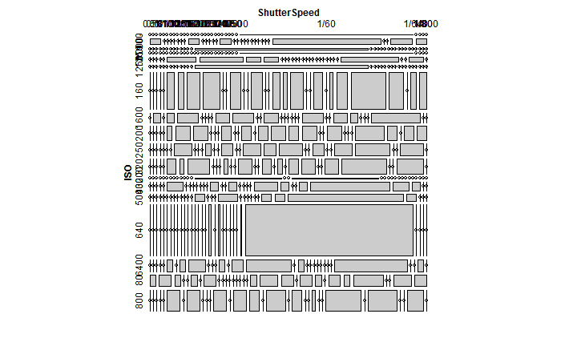
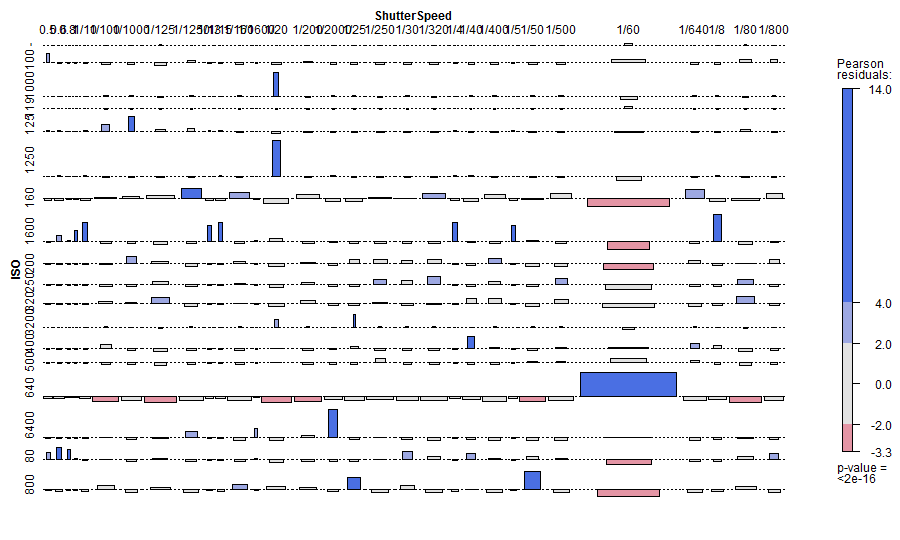

  
<style>
.container{width:900px;}

body{
  font-family: 'Oxygen', sans-serif;
  font-size: 16px;
  line-height: 24px;
}

h1,h2,h3,h4 {
font-family: 'Raleway', sans-serif;
}

.container { width: 1200px; }

h3 {
background-color: #D4DAEC;
  text-indent: 100px; 
}

h4 {
text-indent: 100px;
}
</style>
  
<a href="https://github.com/timelyportfolio/rCharts_catcorrjs"></a>


# Photo EXIF Analysis | rCharts + catcorrjs

Building on my post [ISO Popularity on Flickr Explore](http://timelyportfolio.blogspot.com/2013/10/iso-popularity-on-flickr-explore.html), I thought I would use R to examine some of my family photos from a recent trip to Disney World.  Realizing that EXIF data is categorical, I also wanted to explore a different use for the new [`catcorrjs`](http://deanmalmgren.github.io/catcorrjs/) with [`rCharts`](http://rcharts.io/howitworks/catcorrjs).

### R Can't Do What?

Rarely these days do I find something I cannot do in R.  However, it seems the ability to read EXIF meta information from images is a weakness for R.  I found `adimpro` which reveals an ability to read very limited EXIF in its documentation, but I could not get it to work.  Even if I had succeeded, the information is too limited.  I also looked into `plotKML`, but its EXIF abilities are limited to read only the EXIF from Wikimedia Commons images.  These images have already parsed the EXIF and Wikimedia Commons provides this information through its API.

Using a little R `system` with the open-source Perl [`exiftool`](http://www.sno.phy.queensu.ca/~phil/exiftool/) command-line tool allows us to fill the gap.  `exiftool` is best described by this very helpful [CameraTechnica post](http://www.cameratechnica.com/2012/05/23/hack-your-exif-data-from-the-command-line-five-fun-uses-for-exiftool/).

<blockquote>
Exiftool was written by Phil Harvey, an amateur photographer who spends his day hours as a nuclear physicist at the Sudbury Neutrino Observatory at Queen’s University. When he saw that his software, originally written to catalog scientific images, was useful for all types of photographs, he elected to freely distribute the open source code to the public. A physicist-photographer-programmer who gives his work away free – this guy has some serious geek cred!
</blockquote>

Thanks Phil Harvey for this masterpiece.  I highly encourage [donating a little](http://www.sno.phy.queensu.ca/~phil/exiftool/#donate) to thank Phil for all his work.

### Command Line with R
If all else fails, then revert back to the good old command-line days and use R's `system` function.  The [CameraTechnica post](http://www.cameratechnica.com/2012/05/23/hack-your-exif-data-from-the-command-line-five-fun-uses-for-exiftool/) mentioned above provided a great start to accessing `exiftool` magic.


```r
#exiftools is really powerful
#http://www.cameratechnica.com/2012/05/23/hack-your-exif-data-from-the-command-line-five-fun-uses-for-exiftool/

#hackiest way to do is just use exiftool through system

#example to see full info on a single photo
#print(system('exiftool -h "../../../../2013-10 Disney/IMG_3555.JPG"', inter=TRUE))


#examine iso across all
#iso.df <- data.frame(
#  system('exiftool -T -r -ISO "../../../../2013-10 Disney"',inter=TRUE),
#  stringsAsFactors = FALSE
#)

#do a combination
info <- system('exiftool -T -r -ISO -ShutterSpeed -CameraTemperature -DateTimeOriginal "../../../../2013-10 Disney"',inter=TRUE)
img.df <- read.delim2(
  textConnection(info),
  stringsAsFactors = FALSE,
  header = FALSE,
  col.names = c("ISO", "ShutterSpeed", "CameraTemp", "Date")
)
#get just date
img.df[,4] <- as.Date(#as.POSIXct(
  paste0(
    gsub(x=substr(img.df[,4],1,10),pattern=":",replacement="-"),
    substr(img.df[,4],11,19)
  )
)
```


### Visualizing Categorical Data (vcd)

EXIF information is categorical data.  R users are fortunate to have the very fine `vcdExtra` for analysis and visualization of categorical data.  Here are a couple of default plots from `vcdExtra` on ISO speed and shutter speed.


```r
img.df$id = 1:NROW(img.df)
require(vcdExtra)
mosaic(structable(img.df[,c(1,2)]))
```

 

```r
assoc(img.df[,c(1,2)],shade=T)
```

 

```r
#plot(x=img.df$ISO, y=lapply(img.df[,2],FUN=function(x){return(eval(parse(text=x)))}))
```


### `catcorrjs` - A Mini `vcdExtra`?

Ever since `d3.js` I really wanted to see an interactive `vcdExtra`.  `catcorrjs` in some ways is a nice start in that direction using `d3.js` and `crossfilter`.  Although `catcorrjs` seems designed for survey data, applying it to some EXIF metadata shouldn't hurt anything.


```r
require(rCharts)

#remove iso speeds that are not numeric
#manual for now
img.df <- img.df[-(which(is.na(as.numeric(img.df[,1])))),]
img.df$Date <- format(img.df$Date)


catCorrPlot <- function(questions, responses){
  require(rCharts)
  #responses = read.csv(responses_doc)
  responses = toJSONArray(setNames(
    responses[,-1], 1:(NCOL(responses) - 1)
  ), json = F)
  #questions = read.csv(questions_doc, stringsAsFactors = F)
  questions = lapply(1:NROW(questions), function(i){
    qi = as.list(questions[i,])
    qi$choices = strsplit(qi$choices, ";")[[1]]
    qi$number = i
    qi
  })
  questions = toJSONArray(questions, json = F)
  r1 <- rCharts$new()
  r1$setLib('http://timelyportfolio.github.io/howitworks/catcorrjs/catcorrjs')
  r1$set(questions = questions, responses = responses)
  r1
}

responses <- img.df[,c(4,4,1,2)]
questions <- do.call(rbind,lapply(1:2,function(x){
  choices <- unique(img.df[,x])
  choices <- choices[order(unlist(lapply(choices,function(x){
    as.numeric(eval(parse(text=x)))
  })))]
  return(data.frame(
      "outcome",
      colnames(img.df)[x],
      capture.output(cat(choices,sep=";")),
      stringsAsFactors = F
    )
  )
  }
))
colnames(questions) <- c("type","text","choices")
questions <- rbind(questions,c("demographic","Date", capture.output(cat(unique(img.df[,4]),sep=";"))))
questions <- questions[c(3,1,2),]   

r1 <- catCorrPlot(questions, responses)
r1$show("inline")
```


<div id = 'chart1ce01ece60c9' class = 'rChart catcorrjs'></div>
<script type='text/javascript'>
var ccchart1ce01ece60c9 = catcorr("#chart1ce01ece60c9", {
 "dom": "chart1ce01ece60c9",
"width":    800,
"height":    400,
"questions": [
 {
 "type": "demographic",
"text": "Date",
"choices": [ "2013-10-27", "2013-10-28", "2013-10-29" ],
"number": 1 
},
{
 "type": "outcome",
"text": "ISO",
"choices": [ "80", "100", "119", "125", "160", "200", "250", "320", "400", "500", "640", "800", "1000", "1250", "1600", "3200", "6400" ],
"number": 2 
},
{
 "type": "outcome",
"text": "ShutterSpeed",
"choices": [ "1/2000", "1/1600", "1/1250", "1/1000", "1/800", "1/640", "1/500", "1/400", "1/320", "1/250", "1/200", "1/160", "1/125", "1/100", "1/80", "1/60", "1/50", "1/40", "1/30", "1/25", "1/20", "1/15", "1/13", "1/10", "1/8", "1/5", "1/4", "0.5", "0.6", "0.8", "1" ],
"number": 3 
} 
],
"responses": [
 {
 "1": "2013-10-27",
"2": "640",
"3": "1/60" 
},
{
 "1": "2013-10-27",
"2": "250",
"3": "1/60" 
},
{
 "1": "2013-10-27",
"2": "160",
"3": "1/60" 
},
{
 "1": "2013-10-27",
"2": "160",
"3": "1/125" 
},
{
 "1": "2013-10-27",
"2": "250",
"3": "1/60" 
},
{
 "1": "2013-10-27",
"2": "250",
"3": "1/60" 
},
{
 "1": "2013-10-27",
"2": "200",
"3": "1/60" 
},
{
 "1": "2013-10-27",
"2": "125",
"3": "1/1000" 
},
{
 "1": "2013-10-27",
"2": "160",
"3": "1/1000" 
},
{
 "1": "2013-10-27",
"2": "125",
"3": "1/1250" 
},
{
 "1": "2013-10-27",
"2": "160",
"3": "1/800" 
},
{
 "1": "2013-10-27",
"2": "6400",
"3": "1/2000" 
},
{
 "1": "2013-10-27",
"2": "6400",
"3": "1/2000" 
},
{
 "1": "2013-10-27",
"2": "6400",
"3": "1/2000" 
},
{
 "1": "2013-10-27",
"2": "6400",
"3": "1/2000" 
},
{
 "1": "2013-10-27",
"2": "6400",
"3": "1/2000" 
},
{
 "1": "2013-10-27",
"2": "6400",
"3": "1/2000" 
},
{
 "1": "2013-10-27",
"2": "6400",
"3": "1/1250" 
},
{
 "1": "2013-10-27",
"2": "6400",
"3": "1/1250" 
},
{
 "1": "2013-10-27",
"2": "6400",
"3": "1/250" 
},
{
 "1": "2013-10-27",
"2": "320",
"3": "1/125" 
},
{
 "1": "2013-10-27",
"2": "160",
"3": "1/160" 
},
{
 "1": "2013-10-27",
"2": "200",
"3": "1/100" 
},
{
 "1": "2013-10-27",
"2": "160",
"3": "1/125" 
},
{
 "1": "2013-10-27",
"2": "160",
"3": "1/100" 
},
{
 "1": "2013-10-27",
"2": "640",
"3": "1/60" 
},
{
 "1": "2013-10-27",
"2": "800",
"3": "1/50" 
},
{
 "1": "2013-10-27",
"2": "800",
"3": "1/50" 
},
{
 "1": "2013-10-27",
"2": "800",
"3": "1/50" 
},
{
 "1": "2013-10-27",
"2": "800",
"3": "1/60" 
},
{
 "1": "2013-10-27",
"2": "800",
"3": "1/40" 
},
{
 "1": "2013-10-27",
"2": "800",
"3": "1/60" 
},
{
 "1": "2013-10-27",
"2": "500",
"3": "1/50" 
},
{
 "1": "2013-10-27",
"2": "800",
"3": "1/60" 
},
{
 "1": "2013-10-27",
"2": "800",
"3": "1/60" 
},
{
 "1": "2013-10-27",
"2": "400",
"3": "1/60" 
},
{
 "1": "2013-10-27",
"2": "400",
"3": "1/60" 
},
{
 "1": "2013-10-27",
"2": "320",
"3": "1/60" 
},
{
 "1": "2013-10-27",
"2": "160",
"3": "1/640" 
},
{
 "1": "2013-10-27",
"2": "125",
"3": "1/1000" 
},
{
 "1": "2013-10-27",
"2": "125",
"3": "1/1000" 
},
{
 "1": "2013-10-27",
"2": "640",
"3": "1/60" 
},
{
 "1": "2013-10-27",
"2": "400",
"3": "1/8" 
},
{
 "1": "2013-10-27",
"2": "640",
"3": "1/60" 
},
{
 "1": "2013-10-27",
"2": "200",
"3": "1/60" 
},
{
 "1": "2013-10-27",
"2": "400",
"3": "1/60" 
},
{
 "1": "2013-10-27",
"2": "640",
"3": "1/60" 
},
{
 "1": "2013-10-27",
"2": "640",
"3": "1/60" 
},
{
 "1": "2013-10-27",
"2": "500",
"3": "1/60" 
},
{
 "1": "2013-10-27",
"2": "640",
"3": "1/60" 
},
{
 "1": "2013-10-27",
"2": "1000",
"3": "1/20" 
},
{
 "1": "2013-10-27",
"2": "1000",
"3": "1/20" 
},
{
 "1": "2013-10-27",
"2": "1250",
"3": "1/20" 
},
{
 "1": "2013-10-27",
"2": "1250",
"3": "1/20" 
},
{
 "1": "2013-10-27",
"2": "1250",
"3": "1/20" 
},
{
 "1": "2013-10-27",
"2": "1250",
"3": "1/20" 
},
{
 "1": "2013-10-27",
"2": "1250",
"3": "1/20" 
},
{
 "1": "2013-10-27",
"2": "800",
"3": "1/125" 
},
{
 "1": "2013-10-27",
"2": "800",
"3": "1/125" 
},
{
 "1": "2013-10-27",
"2": "800",
"3": "1/80" 
},
{
 "1": "2013-10-27",
"2": "800",
"3": "1/80" 
},
{
 "1": "2013-10-27",
"2": "800",
"3": "1/160" 
},
{
 "1": "2013-10-27",
"2": "800",
"3": "1/160" 
},
{
 "1": "2013-10-27",
"2": "800",
"3": "1/100" 
},
{
 "1": "2013-10-27",
"2": "800",
"3": "1/100" 
},
{
 "1": "2013-10-27",
"2": "800",
"3": "1/160" 
},
{
 "1": "2013-10-27",
"2": "800",
"3": "1/125" 
},
{
 "1": "2013-10-27",
"2": "800",
"3": "1/125" 
},
{
 "1": "2013-10-27",
"2": "800",
"3": "1/160" 
},
{
 "1": "2013-10-27",
"2": "800",
"3": "1/80" 
},
{
 "1": "2013-10-27",
"2": "800",
"3": "1/80" 
},
{
 "1": "2013-10-27",
"2": "800",
"3": "1/100" 
},
{
 "1": "2013-10-27",
"2": "800",
"3": "1/100" 
},
{
 "1": "2013-10-27",
"2": "125",
"3": "1/100" 
},
{
 "1": "2013-10-27",
"2": "125",
"3": "1/100" 
},
{
 "1": "2013-10-27",
"2": "100",
"3": "1/80" 
},
{
 "1": "2013-10-27",
"2": "100",
"3": "1/80" 
},
{
 "1": "2013-10-27",
"2": "200",
"3": "1/250" 
},
{
 "1": "2013-10-27",
"2": "160",
"3": "1/100" 
},
{
 "1": "2013-10-27",
"2": "160",
"3": "1/100" 
},
{
 "1": "2013-10-27",
"2": "160",
"3": "1/400" 
},
{
 "1": "2013-10-27",
"2": "160",
"3": "1/640" 
},
{
 "1": "2013-10-27",
"2": "160",
"3": "1/400" 
},
{
 "1": "2013-10-27",
"2": "160",
"3": "1/1250" 
},
{
 "1": "2013-10-27",
"2": "160",
"3": "1/200" 
},
{
 "1": "2013-10-27",
"2": "160",
"3": "1/250" 
},
{
 "1": "2013-10-27",
"2": "160",
"3": "1/640" 
},
{
 "1": "2013-10-27",
"2": "320",
"3": "1/60" 
},
{
 "1": "2013-10-27",
"2": "1600",
"3": "1" 
},
{
 "1": "2013-10-27",
"2": "800",
"3": "1/20" 
},
{
 "1": "2013-10-27",
"2": "800",
"3": "1/20" 
},
{
 "1": "2013-10-27",
"2": "1600",
"3": "1/4" 
},
{
 "1": "2013-10-27",
"2": "800",
"3": "1/60" 
},
{
 "1": "2013-10-27",
"2": "400",
"3": "1/25" 
},
{
 "1": "2013-10-27",
"2": "800",
"3": "1/25" 
},
{
 "1": "2013-10-27",
"2": "200",
"3": "1/25" 
},
{
 "1": "2013-10-27",
"2": "800",
"3": "1/50" 
},
{
 "1": "2013-10-27",
"2": "640",
"3": "1/60" 
},
{
 "1": "2013-10-27",
"2": "640",
"3": "1/60" 
},
{
 "1": "2013-10-27",
"2": "640",
"3": "1/60" 
},
{
 "1": "2013-10-27",
"2": "640",
"3": "1/60" 
},
{
 "1": "2013-10-27",
"2": "640",
"3": "1/60" 
},
{
 "1": "2013-10-27",
"2": "640",
"3": "1/60" 
},
{
 "1": "2013-10-27",
"2": "640",
"3": "1/60" 
},
{
 "1": "2013-10-27",
"2": "640",
"3": "1/60" 
},
{
 "1": "2013-10-27",
"2": "500",
"3": "1/60" 
},
{
 "1": "2013-10-27",
"2": "640",
"3": "1/60" 
},
{
 "1": "2013-10-27",
"2": "400",
"3": "1/60" 
},
{
 "1": "2013-10-27",
"2": "640",
"3": "1/60" 
},
{
 "1": "2013-10-27",
"2": "400",
"3": "1/60" 
},
{
 "1": "2013-10-27",
"2": "640",
"3": "1/60" 
},
{
 "1": "2013-10-27",
"2": "640",
"3": "1/60" 
},
{
 "1": "2013-10-27",
"2": "640",
"3": "1/60" 
},
{
 "1": "2013-10-27",
"2": "640",
"3": "1/60" 
},
{
 "1": "2013-10-27",
"2": "640",
"3": "1/60" 
},
{
 "1": "2013-10-27",
"2": "640",
"3": "1/60" 
},
{
 "1": "2013-10-27",
"2": "640",
"3": "1/60" 
},
{
 "1": "2013-10-27",
"2": "400",
"3": "1/60" 
},
{
 "1": "2013-10-27",
"2": "80",
"3": "1/60" 
},
{
 "1": "2013-10-27",
"2": "640",
"3": "1/60" 
},
{
 "1": "2013-10-27",
"2": "640",
"3": "1/60" 
},
{
 "1": "2013-10-27",
"2": "500",
"3": "1/60" 
},
{
 "1": "2013-10-27",
"2": "640",
"3": "1/60" 
},
{
 "1": "2013-10-27",
"2": "640",
"3": "1/60" 
},
{
 "1": "2013-10-27",
"2": "640",
"3": "1/60" 
},
{
 "1": "2013-10-27",
"2": "640",
"3": "1/60" 
},
{
 "1": "2013-10-27",
"2": "640",
"3": "1/60" 
},
{
 "1": "2013-10-27",
"2": "640",
"3": "1/60" 
},
{
 "1": "2013-10-27",
"2": "640",
"3": "1/60" 
},
{
 "1": "2013-10-27",
"2": "640",
"3": "1/60" 
},
{
 "1": "2013-10-27",
"2": "640",
"3": "1/60" 
},
{
 "1": "2013-10-27",
"2": "640",
"3": "1/60" 
},
{
 "1": "2013-10-27",
"2": "640",
"3": "1/60" 
},
{
 "1": "2013-10-27",
"2": "500",
"3": "1/60" 
},
{
 "1": "2013-10-27",
"2": "500",
"3": "1/60" 
},
{
 "1": "2013-10-27",
"2": "640",
"3": "1/60" 
},
{
 "1": "2013-10-27",
"2": "640",
"3": "1/60" 
},
{
 "1": "2013-10-27",
"2": "640",
"3": "1/60" 
},
{
 "1": "2013-10-27",
"2": "640",
"3": "1/60" 
},
{
 "1": "2013-10-27",
"2": "640",
"3": "1/60" 
},
{
 "1": "2013-10-27",
"2": "640",
"3": "1/60" 
},
{
 "1": "2013-10-27",
"2": "640",
"3": "1/60" 
},
{
 "1": "2013-10-27",
"2": "640",
"3": "1/60" 
},
{
 "1": "2013-10-27",
"2": "640",
"3": "1/60" 
},
{
 "1": "2013-10-27",
"2": "640",
"3": "1/60" 
},
{
 "1": "2013-10-27",
"2": "6400",
"3": "1/60" 
},
{
 "1": "2013-10-27",
"2": "6400",
"3": "1/60" 
},
{
 "1": "2013-10-27",
"2": "6400",
"3": "1/60" 
},
{
 "1": "2013-10-27",
"2": "6400",
"3": "1/60" 
},
{
 "1": "2013-10-27",
"2": "6400",
"3": "1/60" 
},
{
 "1": "2013-10-27",
"2": "6400",
"3": "1/60" 
},
{
 "1": "2013-10-27",
"2": "6400",
"3": "1/100" 
},
{
 "1": "2013-10-27",
"2": "6400",
"3": "1/60" 
},
{
 "1": "2013-10-27",
"2": "6400",
"3": "1/60" 
},
{
 "1": "2013-10-27",
"2": "6400",
"3": "1/60" 
},
{
 "1": "2013-10-27",
"2": "6400",
"3": "1/60" 
},
{
 "1": "2013-10-27",
"2": "6400",
"3": "1/60" 
},
{
 "1": "2013-10-27",
"2": "6400",
"3": "1/60" 
},
{
 "1": "2013-10-27",
"2": "6400",
"3": "1/60" 
},
{
 "1": "2013-10-28",
"2": "6400",
"3": "1/1600" 
},
{
 "1": "2013-10-28",
"2": "250",
"3": "1/60" 
},
{
 "1": "2013-10-28",
"2": "6400",
"3": "1/2000" 
},
{
 "1": "2013-10-28",
"2": "6400",
"3": "1/2000" 
},
{
 "1": "2013-10-28",
"2": "6400",
"3": "1/1250" 
},
{
 "1": "2013-10-28",
"2": "6400",
"3": "1/200" 
},
{
 "1": "2013-10-28",
"2": "6400",
"3": "1/200" 
},
{
 "1": "2013-10-28",
"2": "6400",
"3": "1/125" 
},
{
 "1": "2013-10-28",
"2": "6400",
"3": "1/80" 
},
{
 "1": "2013-10-28",
"2": "400",
"3": "1/60" 
},
{
 "1": "2013-10-28",
"2": "500",
"3": "1/60" 
},
{
 "1": "2013-10-28",
"2": "640",
"3": "1/60" 
},
{
 "1": "2013-10-28",
"2": "640",
"3": "1/60" 
},
{
 "1": "2013-10-28",
"2": "640",
"3": "1/60" 
},
{
 "1": "2013-10-28",
"2": "640",
"3": "1/60" 
},
{
 "1": "2013-10-28",
"2": "640",
"3": "1/60" 
},
{
 "1": "2013-10-28",
"2": "500",
"3": "1/60" 
},
{
 "1": "2013-10-28",
"2": "640",
"3": "1/60" 
},
{
 "1": "2013-10-28",
"2": "160",
"3": "1/320" 
},
{
 "1": "2013-10-28",
"2": "160",
"3": "1/250" 
},
{
 "1": "2013-10-28",
"2": "250",
"3": "1/500" 
},
{
 "1": "2013-10-28",
"2": "640",
"3": "1/60" 
},
{
 "1": "2013-10-28",
"2": "640",
"3": "1/60" 
},
{
 "1": "2013-10-28",
"2": "640",
"3": "1/60" 
},
{
 "1": "2013-10-28",
"2": "640",
"3": "1/60" 
},
{
 "1": "2013-10-28",
"2": "640",
"3": "1/60" 
},
{
 "1": "2013-10-28",
"2": "640",
"3": "1/60" 
},
{
 "1": "2013-10-28",
"2": "640",
"3": "1/60" 
},
{
 "1": "2013-10-28",
"2": "500",
"3": "1/60" 
},
{
 "1": "2013-10-28",
"2": "320",
"3": "1/60" 
},
{
 "1": "2013-10-28",
"2": "640",
"3": "1/60" 
},
{
 "1": "2013-10-28",
"2": "640",
"3": "1/60" 
},
{
 "1": "2013-10-28",
"2": "640",
"3": "1/60" 
},
{
 "1": "2013-10-28",
"2": "640",
"3": "1/60" 
},
{
 "1": "2013-10-28",
"2": "640",
"3": "1/60" 
},
{
 "1": "2013-10-28",
"2": "640",
"3": "1/60" 
},
{
 "1": "2013-10-28",
"2": "640",
"3": "1/60" 
},
{
 "1": "2013-10-28",
"2": "1600",
"3": "1/5" 
},
{
 "1": "2013-10-28",
"2": "1600",
"3": "1/4" 
},
{
 "1": "2013-10-28",
"2": "250",
"3": "1/30" 
},
{
 "1": "2013-10-28",
"2": "250",
"3": "1/30" 
},
{
 "1": "2013-10-28",
"2": "800",
"3": "1/30" 
},
{
 "1": "2013-10-28",
"2": "800",
"3": "1/30" 
},
{
 "1": "2013-10-28",
"2": "1600",
"3": "1/13" 
},
{
 "1": "2013-10-28",
"2": "1250",
"3": "1/20" 
},
{
 "1": "2013-10-28",
"2": "200",
"3": "1/800" 
},
{
 "1": "2013-10-28",
"2": "200",
"3": "1/800" 
},
{
 "1": "2013-10-28",
"2": "160",
"3": "1/50" 
},
{
 "1": "2013-10-28",
"2": "160",
"3": "1/50" 
},
{
 "1": "2013-10-28",
"2": "640",
"3": "1/60" 
},
{
 "1": "2013-10-28",
"2": "640",
"3": "1/60" 
},
{
 "1": "2013-10-28",
"2": "640",
"3": "1/60" 
},
{
 "1": "2013-10-28",
"2": "640",
"3": "1/60" 
},
{
 "1": "2013-10-28",
"2": "160",
"3": "1/30" 
},
{
 "1": "2013-10-28",
"2": "160",
"3": "1/30" 
},
{
 "1": "2013-10-28",
"2": "160",
"3": "1/60" 
},
{
 "1": "2013-10-28",
"2": "250",
"3": "1/160" 
},
{
 "1": "2013-10-28",
"2": "640",
"3": "1/60" 
},
{
 "1": "2013-10-28",
"2": "640",
"3": "1/60" 
},
{
 "1": "2013-10-28",
"2": "640",
"3": "1/60" 
},
{
 "1": "2013-10-28",
"2": "640",
"3": "1/60" 
},
{
 "1": "2013-10-28",
"2": "640",
"3": "1/60" 
},
{
 "1": "2013-10-28",
"2": "640",
"3": "1/60" 
},
{
 "1": "2013-10-28",
"2": "640",
"3": "1/60" 
},
{
 "1": "2013-10-28",
"2": "640",
"3": "1/60" 
},
{
 "1": "2013-10-28",
"2": "640",
"3": "1/60" 
},
{
 "1": "2013-10-28",
"2": "160",
"3": "1/640" 
},
{
 "1": "2013-10-28",
"2": "200",
"3": "1/1000" 
},
{
 "1": "2013-10-28",
"2": "160",
"3": "1/500" 
},
{
 "1": "2013-10-28",
"2": "640",
"3": "1/60" 
},
{
 "1": "2013-10-28",
"2": "640",
"3": "1/60" 
},
{
 "1": "2013-10-28",
"2": "640",
"3": "1/60" 
},
{
 "1": "2013-10-28",
"2": "80",
"3": "1/400" 
},
{
 "1": "2013-10-28",
"2": "80",
"3": "1/80" 
},
{
 "1": "2013-10-28",
"2": "80",
"3": "1/60" 
},
{
 "1": "2013-10-28",
"2": "80",
"3": "1/60" 
},
{
 "1": "2013-10-28",
"2": "80",
"3": "0.6" 
},
{
 "1": "2013-10-28",
"2": "80",
"3": "0.6" 
},
{
 "1": "2013-10-28",
"2": "80",
"3": "0.8" 
},
{
 "1": "2013-10-28",
"2": "80",
"3": "0.5" 
},
{
 "1": "2013-10-28",
"2": "80",
"3": "1/250" 
},
{
 "1": "2013-10-28",
"2": "80",
"3": "1/320" 
},
{
 "1": "2013-10-28",
"2": "80",
"3": "1/320" 
},
{
 "1": "2013-10-28",
"2": "80",
"3": "1/800" 
},
{
 "1": "2013-10-28",
"2": "80",
"3": "1/125" 
},
{
 "1": "2013-10-28",
"2": "80",
"3": "1/125" 
},
{
 "1": "2013-10-28",
"2": "80",
"3": "1/30" 
},
{
 "1": "2013-10-28",
"2": "80",
"3": "1/30" 
},
{
 "1": "2013-10-28",
"2": "80",
"3": "1/30" 
},
{
 "1": "2013-10-28",
"2": "80",
"3": "1/50" 
},
{
 "1": "2013-10-28",
"2": "80",
"3": "1/50" 
},
{
 "1": "2013-10-28",
"2": "80",
"3": "1/80" 
},
{
 "1": "2013-10-28",
"2": "80",
"3": "1/80" 
},
{
 "1": "2013-10-28",
"2": "80",
"3": "1/40" 
},
{
 "1": "2013-10-28",
"2": "80",
"3": "1/40" 
},
{
 "1": "2013-10-28",
"2": "320",
"3": "1/125" 
},
{
 "1": "2013-10-28",
"2": "250",
"3": "1/320" 
},
{
 "1": "2013-10-28",
"2": "250",
"3": "1/320" 
},
{
 "1": "2013-10-28",
"2": "250",
"3": "1/320" 
},
{
 "1": "2013-10-28",
"2": "250",
"3": "1/320" 
},
{
 "1": "2013-10-28",
"2": "250",
"3": "1/200" 
},
{
 "1": "2013-10-28",
"2": "250",
"3": "1/200" 
},
{
 "1": "2013-10-28",
"2": "160",
"3": "1/160" 
},
{
 "1": "2013-10-28",
"2": "160",
"3": "1/160" 
},
{
 "1": "2013-10-28",
"2": "200",
"3": "1/160" 
},
{
 "1": "2013-10-28",
"2": "200",
"3": "1/160" 
},
{
 "1": "2013-10-28",
"2": "160",
"3": "1/125" 
},
{
 "1": "2013-10-28",
"2": "160",
"3": "1/125" 
},
{
 "1": "2013-10-28",
"2": "320",
"3": "1/320" 
},
{
 "1": "2013-10-28",
"2": "400",
"3": "1/100" 
},
{
 "1": "2013-10-28",
"2": "400",
"3": "1/100" 
},
{
 "1": "2013-10-28",
"2": "200",
"3": "1/320" 
},
{
 "1": "2013-10-28",
"2": "250",
"3": "1/250" 
},
{
 "1": "2013-10-28",
"2": "250",
"3": "1/250" 
},
{
 "1": "2013-10-28",
"2": "800",
"3": "1/200" 
},
{
 "1": "2013-10-28",
"2": "800",
"3": "1/200" 
},
{
 "1": "2013-10-28",
"2": "250",
"3": "1/125" 
},
{
 "1": "2013-10-28",
"2": "250",
"3": "1/125" 
},
{
 "1": "2013-10-28",
"2": "160",
"3": "1/400" 
},
{
 "1": "2013-10-28",
"2": "160",
"3": "1/400" 
},
{
 "1": "2013-10-28",
"2": "160",
"3": "1/500" 
},
{
 "1": "2013-10-28",
"2": "320",
"3": "1/500" 
},
{
 "1": "2013-10-28",
"2": "160",
"3": "1/125" 
},
{
 "1": "2013-10-28",
"2": "160",
"3": "1/320" 
},
{
 "1": "2013-10-28",
"2": "160",
"3": "1/320" 
},
{
 "1": "2013-10-28",
"2": "200",
"3": "1/400" 
},
{
 "1": "2013-10-28",
"2": "400",
"3": "1/640" 
},
{
 "1": "2013-10-28",
"2": "500",
"3": "1/250" 
},
{
 "1": "2013-10-28",
"2": "160",
"3": "1/500" 
},
{
 "1": "2013-10-28",
"2": "500",
"3": "1/250" 
},
{
 "1": "2013-10-28",
"2": "250",
"3": "1/400" 
},
{
 "1": "2013-10-28",
"2": "250",
"3": "1/400" 
},
{
 "1": "2013-10-28",
"2": "320",
"3": "1/400" 
},
{
 "1": "2013-10-28",
"2": "320",
"3": "1/400" 
},
{
 "1": "2013-10-28",
"2": "200",
"3": "1/250" 
},
{
 "1": "2013-10-28",
"2": "200",
"3": "1/250" 
},
{
 "1": "2013-10-28",
"2": "160",
"3": "1/125" 
},
{
 "1": "2013-10-28",
"2": "200",
"3": "1/125" 
},
{
 "1": "2013-10-28",
"2": "200",
"3": "1/125" 
},
{
 "1": "2013-10-28",
"2": "200",
"3": "1/125" 
},
{
 "1": "2013-10-28",
"2": "160",
"3": "1/160" 
},
{
 "1": "2013-10-28",
"2": "160",
"3": "1/160" 
},
{
 "1": "2013-10-28",
"2": "160",
"3": "1/100" 
},
{
 "1": "2013-10-28",
"2": "640",
"3": "1/250" 
},
{
 "1": "2013-10-28",
"2": "640",
"3": "1/250" 
},
{
 "1": "2013-10-28",
"2": "800",
"3": "1/200" 
},
{
 "1": "2013-10-28",
"2": "160",
"3": "1/640" 
},
{
 "1": "2013-10-28",
"2": "160",
"3": "1/640" 
},
{
 "1": "2013-10-28",
"2": "160",
"3": "1/200" 
},
{
 "1": "2013-10-28",
"2": "160",
"3": "1/200" 
},
{
 "1": "2013-10-28",
"2": "160",
"3": "1/800" 
},
{
 "1": "2013-10-28",
"2": "320",
"3": "1/400" 
},
{
 "1": "2013-10-28",
"2": "400",
"3": "1/640" 
},
{
 "1": "2013-10-28",
"2": "200",
"3": "1/400" 
},
{
 "1": "2013-10-28",
"2": "200",
"3": "1/640" 
},
{
 "1": "2013-10-28",
"2": "320",
"3": "1/250" 
},
{
 "1": "2013-10-28",
"2": "320",
"3": "1/160" 
},
{
 "1": "2013-10-28",
"2": "250",
"3": "1/500" 
},
{
 "1": "2013-10-28",
"2": "200",
"3": "1/400" 
},
{
 "1": "2013-10-28",
"2": "320",
"3": "1/500" 
},
{
 "1": "2013-10-28",
"2": "320",
"3": "1/500" 
},
{
 "1": "2013-10-28",
"2": "200",
"3": "1/640" 
},
{
 "1": "2013-10-28",
"2": "320",
"3": "1/1000" 
},
{
 "1": "2013-10-28",
"2": "200",
"3": "1/200" 
},
{
 "1": "2013-10-28",
"2": "160",
"3": "1/80" 
},
{
 "1": "2013-10-28",
"2": "250",
"3": "1/80" 
},
{
 "1": "2013-10-28",
"2": "250",
"3": "1/80" 
},
{
 "1": "2013-10-28",
"2": "200",
"3": "1/80" 
},
{
 "1": "2013-10-28",
"2": "200",
"3": "1/80" 
},
{
 "1": "2013-10-28",
"2": "125",
"3": "1/80" 
},
{
 "1": "2013-10-28",
"2": "160",
"3": "1/500" 
},
{
 "1": "2013-10-28",
"2": "160",
"3": "1/1250" 
},
{
 "1": "2013-10-28",
"2": "250",
"3": "1/60" 
},
{
 "1": "2013-10-28",
"2": "160",
"3": "1/60" 
},
{
 "1": "2013-10-28",
"2": "160",
"3": "1/60" 
},
{
 "1": "2013-10-28",
"2": "640",
"3": "1/60" 
},
{
 "1": "2013-10-28",
"2": "320",
"3": "1/60" 
},
{
 "1": "2013-10-28",
"2": "320",
"3": "1/60" 
},
{
 "1": "2013-10-28",
"2": "1600",
"3": "1/8" 
},
{
 "1": "2013-10-28",
"2": "640",
"3": "1/60" 
},
{
 "1": "2013-10-28",
"2": "800",
"3": "1/60" 
},
{
 "1": "2013-10-28",
"2": "400",
"3": "1/20" 
},
{
 "1": "2013-10-28",
"2": "1600",
"3": "1/8" 
},
{
 "1": "2013-10-28",
"2": "640",
"3": "1/60" 
},
{
 "1": "2013-10-28",
"2": "640",
"3": "1/60" 
},
{
 "1": "2013-10-28",
"2": "640",
"3": "1/60" 
},
{
 "1": "2013-10-28",
"2": "640",
"3": "1/60" 
},
{
 "1": "2013-10-29",
"2": "500",
"3": "1/20" 
},
{
 "1": "2013-10-29",
"2": "800",
"3": "1/50" 
},
{
 "1": "2013-10-29",
"2": "800",
"3": "1/50" 
},
{
 "1": "2013-10-29",
"2": "800",
"3": "1/50" 
},
{
 "1": "2013-10-29",
"2": "400",
"3": "1/60" 
},
{
 "1": "2013-10-29",
"2": "500",
"3": "1/60" 
},
{
 "1": "2013-10-29",
"2": "640",
"3": "1/60" 
},
{
 "1": "2013-10-29",
"2": "500",
"3": "1/60" 
},
{
 "1": "2013-10-29",
"2": "640",
"3": "1/60" 
},
{
 "1": "2013-10-29",
"2": "640",
"3": "1/60" 
},
{
 "1": "2013-10-29",
"2": "800",
"3": "1/60" 
},
{
 "1": "2013-10-29",
"2": "800",
"3": "1/60" 
},
{
 "1": "2013-10-29",
"2": "160",
"3": "1/125" 
},
{
 "1": "2013-10-29",
"2": "200",
"3": "1/25" 
},
{
 "1": "2013-10-29",
"2": "640",
"3": "1/60" 
},
{
 "1": "2013-10-29",
"2": "640",
"3": "1/500" 
},
{
 "1": "2013-10-29",
"2": "400",
"3": "1/400" 
},
{
 "1": "2013-10-29",
"2": "250",
"3": "1/80" 
},
{
 "1": "2013-10-29",
"2": "640",
"3": "1/60" 
},
{
 "1": "2013-10-29",
"2": "640",
"3": "1/60" 
},
{
 "1": "2013-10-29",
"2": "640",
"3": "1/60" 
},
{
 "1": "2013-10-29",
"2": "640",
"3": "1/60" 
},
{
 "1": "2013-10-29",
"2": "640",
"3": "1/60" 
},
{
 "1": "2013-10-29",
"2": "640",
"3": "1/60" 
},
{
 "1": "2013-10-29",
"2": "250",
"3": "1/60" 
},
{
 "1": "2013-10-29",
"2": "160",
"3": "1/60" 
},
{
 "1": "2013-10-29",
"2": "160",
"3": "1/60" 
},
{
 "1": "2013-10-29",
"2": "160",
"3": "1/60" 
},
{
 "1": "2013-10-29",
"2": "125",
"3": "1/60" 
},
{
 "1": "2013-10-29",
"2": "160",
"3": "1/60" 
},
{
 "1": "2013-10-29",
"2": "320",
"3": "1/125" 
},
{
 "1": "2013-10-29",
"2": "320",
"3": "1/200" 
},
{
 "1": "2013-10-29",
"2": "200",
"3": "1/60" 
},
{
 "1": "2013-10-29",
"2": "200",
"3": "1/60" 
},
{
 "1": "2013-10-29",
"2": "200",
"3": "1/60" 
},
{
 "1": "2013-10-29",
"2": "320",
"3": "1/200" 
},
{
 "1": "2013-10-29",
"2": "100",
"3": "1/60" 
},
{
 "1": "2013-10-29",
"2": "160",
"3": "1/60" 
},
{
 "1": "2013-10-29",
"2": "320",
"3": "1/100" 
},
{
 "1": "2013-10-29",
"2": "320",
"3": "1/100" 
},
{
 "1": "2013-10-29",
"2": "160",
"3": "1/60" 
},
{
 "1": "2013-10-29",
"2": "80",
"3": "1/60" 
},
{
 "1": "2013-10-29",
"2": "160",
"3": "1/60" 
},
{
 "1": "2013-10-29",
"2": "320",
"3": "1/125" 
},
{
 "1": "2013-10-29",
"2": "160",
"3": "1/60" 
},
{
 "1": "2013-10-29",
"2": "160",
"3": "1/60" 
},
{
 "1": "2013-10-29",
"2": "320",
"3": "1/125" 
},
{
 "1": "2013-10-29",
"2": "200",
"3": "1/60" 
},
{
 "1": "2013-10-29",
"2": "250",
"3": "1/125" 
},
{
 "1": "2013-10-29",
"2": "160",
"3": "1/60" 
},
{
 "1": "2013-10-29",
"2": "320",
"3": "1/60" 
},
{
 "1": "2013-10-29",
"2": "320",
"3": "1/60" 
},
{
 "1": "2013-10-29",
"2": "125",
"3": "1/60" 
},
{
 "1": "2013-10-29",
"2": "125",
"3": "1/60" 
},
{
 "1": "2013-10-29",
"2": "125",
"3": "1/60" 
},
{
 "1": "2013-10-29",
"2": "640",
"3": "1/60" 
},
{
 "1": "2013-10-29",
"2": "500",
"3": "1/60" 
},
{
 "1": "2013-10-29",
"2": "640",
"3": "1/60" 
},
{
 "1": "2013-10-29",
"2": "400",
"3": "1/60" 
},
{
 "1": "2013-10-29",
"2": "640",
"3": "1/60" 
},
{
 "1": "2013-10-29",
"2": "200",
"3": "1/1000" 
},
{
 "1": "2013-10-29",
"2": "500",
"3": "1/500" 
},
{
 "1": "2013-10-29",
"2": "320",
"3": "1/250" 
},
{
 "1": "2013-10-29",
"2": "200",
"3": "1/200" 
},
{
 "1": "2013-10-29",
"2": "200",
"3": "1/1000" 
},
{
 "1": "2013-10-29",
"2": "160",
"3": "1/200" 
},
{
 "1": "2013-10-29",
"2": "160",
"3": "1/250" 
},
{
 "1": "2013-10-29",
"2": "160",
"3": "1/60" 
},
{
 "1": "2013-10-29",
"2": "160",
"3": "1/320" 
},
{
 "1": "2013-10-29",
"2": "160",
"3": "1/200" 
},
{
 "1": "2013-10-29",
"2": "80",
"3": "1/100" 
},
{
 "1": "2013-10-29",
"2": "640",
"3": "1/320" 
},
{
 "1": "2013-10-29",
"2": "80",
"3": "1/500" 
},
{
 "1": "2013-10-29",
"2": "160",
"3": "1/250" 
},
{
 "1": "2013-10-29",
"2": "100",
"3": "1/1250" 
},
{
 "1": "2013-10-29",
"2": "160",
"3": "1/320" 
},
{
 "1": "2013-10-29",
"2": "160",
"3": "1/800" 
},
{
 "1": "2013-10-29",
"2": "160",
"3": "1/800" 
},
{
 "1": "2013-10-29",
"2": "160",
"3": "1/80" 
},
{
 "1": "2013-10-29",
"2": "160",
"3": "1/80" 
},
{
 "1": "2013-10-29",
"2": "160",
"3": "1/1250" 
},
{
 "1": "2013-10-29",
"2": "160",
"3": "1/1000" 
},
{
 "1": "2013-10-29",
"2": "160",
"3": "1/1250" 
},
{
 "1": "2013-10-29",
"2": "160",
"3": "1/1250" 
},
{
 "1": "2013-10-29",
"2": "100",
"3": "1/800" 
},
{
 "1": "2013-10-29",
"2": "160",
"3": "1/500" 
},
{
 "1": "2013-10-29",
"2": "160",
"3": "1/160" 
},
{
 "1": "2013-10-29",
"2": "160",
"3": "1/500" 
},
{
 "1": "2013-10-29",
"2": "160",
"3": "1/60" 
},
{
 "1": "2013-10-29",
"2": "640",
"3": "1/60" 
},
{
 "1": "2013-10-29",
"2": "400",
"3": "1/60" 
},
{
 "1": "2013-10-29",
"2": "640",
"3": "1/60" 
},
{
 "1": "2013-10-29",
"2": "640",
"3": "1/60" 
},
{
 "1": "2013-10-29",
"2": "640",
"3": "1/60" 
},
{
 "1": "2013-10-29",
"2": "160",
"3": "1/1000" 
},
{
 "1": "2013-10-29",
"2": "80",
"3": "1/800" 
},
{
 "1": "2013-10-29",
"2": "500",
"3": "1/640" 
},
{
 "1": "2013-10-29",
"2": "400",
"3": "1/500" 
},
{
 "1": "2013-10-29",
"2": "1600",
"3": "1/4" 
},
{
 "1": "2013-10-29",
"2": "800",
"3": "1/25" 
},
{
 "1": "2013-10-29",
"2": "800",
"3": "1/20" 
},
{
 "1": "2013-10-29",
"2": "800",
"3": "1/30" 
},
{
 "1": "2013-10-29",
"2": "1600",
"3": "1/10" 
},
{
 "1": "2013-10-29",
"2": "1600",
"3": "1/15" 
},
{
 "1": "2013-10-29",
"2": "1600",
"3": "1/15" 
},
{
 "1": "2013-10-29",
"2": "1600",
"3": "1/15" 
},
{
 "1": "2013-10-29",
"2": "1600",
"3": "1/5" 
},
{
 "1": "2013-10-29",
"2": "1600",
"3": "1/20" 
},
{
 "1": "2013-10-29",
"2": "1600",
"3": "1/20" 
},
{
 "1": "2013-10-29",
"2": "1250",
"3": "1/20" 
},
{
 "1": "2013-10-29",
"2": "1600",
"3": "1/10" 
},
{
 "1": "2013-10-29",
"2": "400",
"3": "1/40" 
},
{
 "1": "2013-10-29",
"2": "400",
"3": "1/40" 
},
{
 "1": "2013-10-29",
"2": "800",
"3": "1/80" 
},
{
 "1": "2013-10-29",
"2": "400",
"3": "1/40" 
},
{
 "1": "2013-10-29",
"2": "800",
"3": "1/50" 
},
{
 "1": "2013-10-29",
"2": "800",
"3": "1/50" 
},
{
 "1": "2013-10-29",
"2": "800",
"3": "1/50" 
},
{
 "1": "2013-10-29",
"2": "800",
"3": "1/50" 
},
{
 "1": "2013-10-29",
"2": "200",
"3": "1/30" 
},
{
 "1": "2013-10-29",
"2": "1250",
"3": "1/20" 
},
{
 "1": "2013-10-29",
"2": "1000",
"3": "1/20" 
},
{
 "1": "2013-10-29",
"2": "320",
"3": "1/40" 
},
{
 "1": "2013-10-29",
"2": "320",
"3": "1/40" 
},
{
 "1": "2013-10-29",
"2": "320",
"3": "1/80" 
},
{
 "1": "2013-10-29",
"2": "80",
"3": "1/60" 
},
{
 "1": "2013-10-29",
"2": "160",
"3": "1/400" 
},
{
 "1": "2013-10-29",
"2": "125",
"3": "1/125" 
},
{
 "1": "2013-10-29",
"2": "500",
"3": "1/60" 
},
{
 "1": "2013-10-29",
"2": "1600",
"3": "1/10" 
},
{
 "1": "2013-10-29",
"2": "1600",
"3": "0.6" 
},
{
 "1": "2013-10-29",
"2": "1600",
"3": "1/13" 
},
{
 "1": "2013-10-29",
"2": "3200",
"3": "1/20" 
},
{
 "1": "2013-10-29",
"2": "3200",
"3": "1/25" 
},
{
 "1": "2013-10-29",
"2": "1600",
"3": "1/8" 
},
{
 "1": "2013-10-29",
"2": "1600",
"3": "1/8" 
},
{
 "1": "2013-10-29",
"2": "1600",
"3": "1/8" 
},
{
 "1": "2013-10-29",
"2": "1600",
"3": "1/8" 
},
{
 "1": "2013-10-29",
"2": "800",
"3": "1/60" 
},
{
 "1": "2013-10-29",
"2": "800",
"3": "1/20" 
},
{
 "1": "2013-10-29",
"2": "800",
"3": "1/25" 
},
{
 "1": "2013-10-29",
"2": "1250",
"3": "1/20" 
},
{
 "1": "2013-10-29",
"2": "640",
"3": "1/60" 
},
{
 "1": "2013-10-29",
"2": "320",
"3": "1/80" 
},
{
 "1": "2013-10-29",
"2": "320",
"3": "1/80" 
},
{
 "1": "2013-10-29",
"2": "320",
"3": "1/80" 
},
{
 "1": "2013-10-29",
"2": "250",
"3": "1/80" 
},
{
 "1": "2013-10-29",
"2": "1600",
"3": "1/8" 
},
{
 "1": "2013-10-29",
"2": "640",
"3": "1/60" 
},
{
 "1": "2013-10-29",
"2": "640",
"3": "1/60" 
},
{
 "1": "2013-10-29",
"2": "640",
"3": "1/60" 
},
{
 "1": "2013-10-29",
"2": "640",
"3": "1/60" 
},
{
 "1": "2013-10-29",
"2": "640",
"3": "1/60" 
},
{
 "1": "2013-10-29",
"2": "640",
"3": "1/60" 
},
{
 "1": "2013-10-29",
"2": "800",
"3": "1/25" 
},
{
 "1": "2013-10-29",
"2": "800",
"3": "1/25" 
},
{
 "1": "2013-10-29",
"2": "1000",
"3": "1/20" 
},
{
 "1": "2013-10-29",
"2": "160",
"3": "1/320" 
},
{
 "1": "2013-10-29",
"2": "800",
"3": "1/25" 
},
{
 "1": "2013-10-29",
"2": "200",
"3": "1/30" 
},
{
 "1": "2013-10-29",
"2": "640",
"3": "1/60" 
},
{
 "1": "2013-10-29",
"2": "640",
"3": "1/60" 
},
{
 "1": "2013-10-29",
"2": "640",
"3": "1/60" 
},
{
 "1": "2013-10-29",
"2": "640",
"3": "1/60" 
},
{
 "1": "2013-10-29",
"2": "640",
"3": "1/60" 
},
{
 "1": "2013-10-29",
"2": "640",
"3": "1/60" 
},
{
 "1": "2013-10-29",
"2": "160",
"3": "1/640" 
},
{
 "1": "2013-10-29",
"2": "160",
"3": "1/640" 
},
{
 "1": "2013-10-29",
"2": "640",
"3": "1/60" 
},
{
 "1": "2013-10-29",
"2": "640",
"3": "1/60" 
},
{
 "1": "2013-10-29",
"2": "640",
"3": "1/60" 
},
{
 "1": "2013-10-29",
"2": "640",
"3": "1/60" 
},
{
 "1": "2013-10-29",
"2": "640",
"3": "1/60" 
},
{
 "1": "2013-10-29",
"2": "640",
"3": "1/60" 
},
{
 "1": "2013-10-29",
"2": "640",
"3": "1/60" 
},
{
 "1": "2013-10-29",
"2": "160",
"3": "1/1250" 
},
{
 "1": "2013-10-29",
"2": "160",
"3": "1/1250" 
},
{
 "1": "2013-10-29",
"2": "160",
"3": "1/320" 
},
{
 "1": "2013-10-29",
"2": "160",
"3": "1/200" 
},
{
 "1": "2013-10-29",
"2": "200",
"3": "1/320" 
},
{
 "1": "2013-10-29",
"2": "160",
"3": "1/1250" 
},
{
 "1": "2013-10-29",
"2": "250",
"3": "1/250" 
},
{
 "1": "2013-10-29",
"2": "160",
"3": "1/1250" 
},
{
 "1": "2013-10-29",
"2": "640",
"3": "1/60" 
},
{
 "1": "2013-10-29",
"2": "320",
"3": "1/60" 
},
{
 "1": "2013-10-29",
"2": "200",
"3": "1/320" 
},
{
 "1": "2013-10-29",
"2": "250",
"3": "1/500" 
},
{
 "1": "2013-10-29",
"2": "100",
"3": "1/200" 
},
{
 "1": "2013-10-29",
"2": "320",
"3": "1/60" 
},
{
 "1": "2013-10-29",
"2": "320",
"3": "1/200" 
},
{
 "1": "2013-10-29",
"2": "160",
"3": "1/60" 
},
{
 "1": "2013-10-29",
"2": "160",
"3": "1/60" 
},
{
 "1": "2013-10-29",
"2": "320",
"3": "1/80" 
},
{
 "1": "2013-10-29",
"2": "320",
"3": "1/60" 
},
{
 "1": "2013-10-29",
"2": "320",
"3": "1/80" 
},
{
 "1": "2013-10-29",
"2": "160",
"3": "1/60" 
},
{
 "1": "2013-10-29",
"2": "100",
"3": "1/60" 
},
{
 "1": "2013-10-29",
"2": "100",
"3": "1/60" 
},
{
 "1": "2013-10-29",
"2": "100",
"3": "1/60" 
},
{
 "1": "2013-10-29",
"2": "100",
"3": "1/60" 
},
{
 "1": "2013-10-29",
"2": "100",
"3": "1/60" 
},
{
 "1": "2013-10-29",
"2": "100",
"3": "1/60" 
},
{
 "1": "2013-10-29",
"2": "100",
"3": "0.5" 
},
{
 "1": "2013-10-29",
"2": "100",
"3": "1/60" 
},
{
 "1": "2013-10-29",
"2": "100",
"3": "1/60" 
},
{
 "1": "2013-10-29",
"2": "100",
"3": "1/60" 
},
{
 "1": "2013-10-27",
"2": "1600",
"3": "1/50" 
},
{
 "1": "2013-10-28",
"2": "119",
"3": "1/60" 
} 
],
"id": "chart1ce01ece60c9" 
});
</script>


### Thanks
- Ramnath Vaidyanathan
- Phil Harvey
- Camera Technica
- Dean Malmgren


